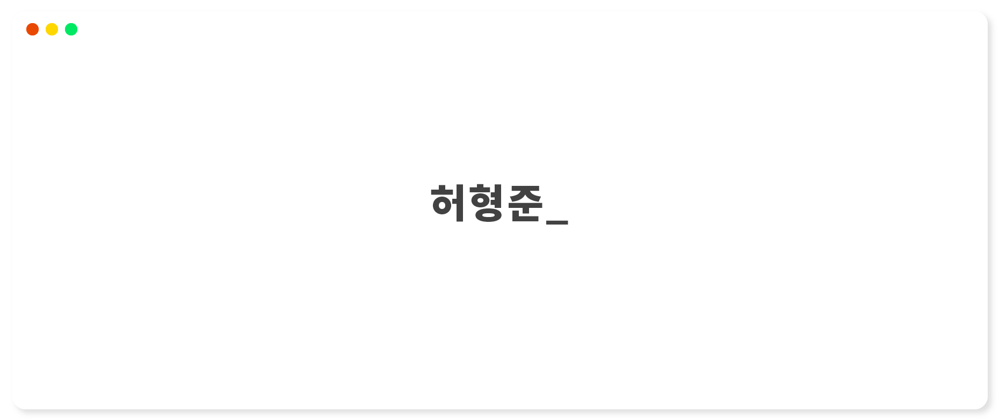

## DipokalHHJ
안녕하세요. 디포칼이란 닉네임으로 활동하고 있는 <a href="https://hhj.devent.kr/" target="_blank">허형준</a>입니다.

 

<!--

**DipokalLab/DipokalLab** is a ✨ _special_ ✨ repository because its `README.md` (this file) appears on your GitHub profile.

Here are some ideas to get you started:

- 🔭 I’m currently working on ...
- 🌱 I’m currently learning ...
- 👯 I’m looking to collaborate on ...
- 🤔 I’m looking for help with ...
- 💬 Ask me about ...
- 📫 How to reach me: ...
- 😄 Pronouns: ...
- ⚡ Fun fact: ...
-->
